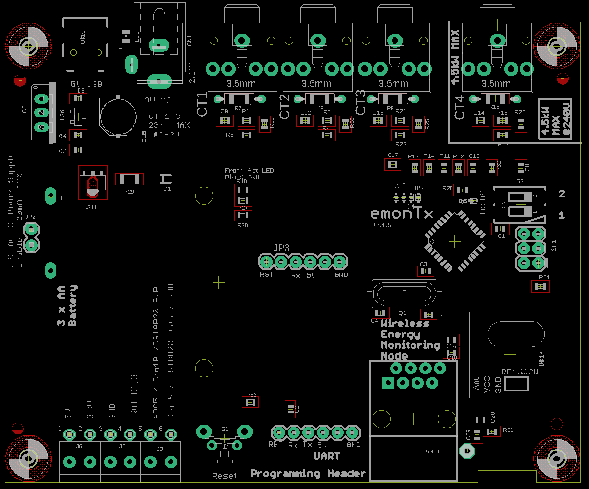

# emonTx V3.4

The emonTx V3.4 is the latest generation of the open-source hardware Arduino compatiable emonTx low power wireless energy monitoring node. The unit has been totally re-designed using surface mount (SMT) electronics to enable automated pre-assembled manufacture here in the UK.

## Hardware change log

### V3.4.5 

*Not yet released as of April 2021*

- Remove MLF ATmega footprint to avoid solder bridges during reflow
- Fix rear silkscreen version number
- Improve via spacing 
- Update R13 & R14 from 1% to 0.1%/0.5% tolerance
- Switch to LDK320ADU33R LDO for higher 18V input voltage

### V3.4.4 

Minor PCB changes:

- fix overlayed double via
- Add protection ring for top-right fiducial

### V3.4.3

**Shipping March/April 2018 onwards**

- Identifiable with blue CT4 jackplug socket (mostly)
- Add extra UART header with Rx/Tx swap-over for easy ESP connection
- Increase  reservoir capacitor of AC-DC circuit C18 16uF to 100uF to allow for greater peak power consumption of RFM69CW (compared to RFM12B)
- Change Burden resistors R7, R8, R9 (22R) from 1% to 0.5% tolerance  to increase accuracy. Wanted to change to 0.1% but unable to source
- Changed Burden resistor R18 (120R) from 1 % to 0.1%
- Change all 470K resistors from 1% to 0.1% (R1, R2, R4, R6, R11, R12, R15, R17, R21, R23, R27, R30)
- Changed CT4 jack plug socket to blue colour to indicate low power high accuracy channel

Live BOM: https://octopart.com/bom-tool/xiwE7CiN

#### V3.4.2

**Aug 2016**

- Same BOM as V3.4.1
- Increase mini USB location pin holes from 0.8mm to 0.9mm

#### 3.4.1 Mar 2015

- lots of via GND links around GND plane - make sure ant has best GND plane possible
- make sure antenna has got GND plane under ant PCB trace
- pull top gnd plane in around RFM69CW module and rear GND plan to cover whole undersided
- Get rid of unused L1
- Move D2 location to not be under battery holder
- Correct terminal block silkscreen
- Disconnect RJ45 pin 1 and 3 from GND, stop power rail short if ethernet cable is connected by mistake

#### V3.4

- More FTDI connection bit to the left
- Increase pads for DIP switch
- Add TVS diodes, CT input protection

### V3.3

- ATmega328 on-board
- Edge SMA Antenna
- Non plate through mounting pads to eliminate interference through enclosure
- RJ45 DS18B20 temperature sensor
- 3 x AA Battery monitor on ADC7
- DIP Switch on Dig8 and Dig9 for Node ID selection
- RFM69CW compatible with SEL line pull-up resistor
- Pulse counting / terminal block IRQ changed from D2 IRQ0 to D3 IRQ1 since RFM12B now uses IRQ0
- Changed MCP1700 3.3V regulator to MCP1702 3.3V regulator to allow for powering from higher voltages (12V max) over RJ45

***

## Links

- [Purchase](http://shop.openenergymonitor.com/emontx-v3/)

- [User Guide](https://guide.openenergymonitor.org/setup/emontx)

- [Hardware Wiki Documentation](http://wiki.openenergymonitor.org/index.php?title=EmonTx_V3.4)

***

### Schematic

### Board

## Portmap

See [Hardware Wiki Documentation](http://wiki.openenergymonitor.org/index.php?title=EmonTx_V3.4) for further technical documentation regarding emonTx.

### Open Hardware

Hardware designs (schematics and CAD) files are licensed under the [Creative Commons Attribution-ShareAlike 3.0 Unported License](http://creativecommons.org/licenses/by-sa/3.0/) and follow the terms of the [OSHW (Open-source hardware) Statement of Principles 1.0.](http://freedomdefined.org/OSHW)
